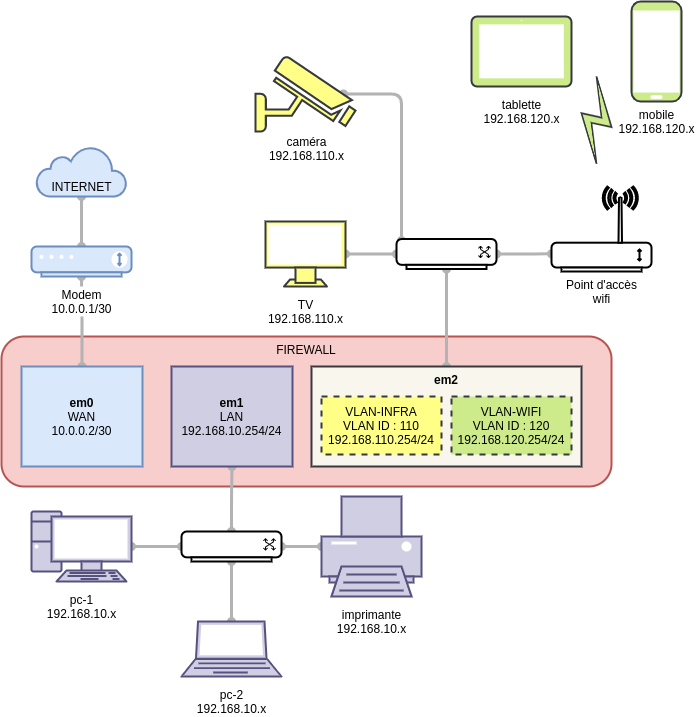

Configuration des interfaces réseaux
===

### 0. Version
OpenBSD : **6.9**

### 1. Architecture



### 2. Configuration

- **Vérification des interfaces disponibles**

```shell
firewall# dmesg | grep -i intel
em0 at pci1 dev 0 function 0 "Intel I211" rev 0x03: msi, address 00:00:00:00:00:00
em1 at pci2 dev 0 function 0 "Intel I211" rev 0x03: msi, address 00:00:00:00:00:01
em2 at pci3 dev 0 function 0 "Intel I211" rev 0x03: msi, address 00:00:00:00:00:02
```

- **Configuration temporaire**
```shell
firewall# ifconfig em0 10.0.0.2 255.255.255.252

firewall# ifconfig em1 192.168.10.254 255.255.255.0

firewall# ifconfig vlan-infra create
firewall# ifconfig vlan-infra parent em2 vnetid 110
firewall# ifconfig vlan-infra 192.168.110.254 255.255.255.0

firewall# ifconfig vlan-wifi create
firewall# ifconfig vlan-wifi parent em2 vnetid 120
firewall# ifconfig vlan-infra 192.168.120.254 255.255.255.0
```

- **Configuration permanente**
```shell
firewall# cat /etc/hostname.em0
inet 10.0.0.2 255.255.255.252 NONE

firewall# cat /etc/hostname.em1
inet 192.168.10.254 255.255.255.0 NONE

firewall# cat /etc/hostname.em2
up

firewall# cat /etc/hostname.vlan-infra
inet 192.168.110.254 255.255.255.0 NONE parent em2 vnetid 110

firewall# cat /etc/hostname.vlan-wifi
inet 192.168.120.254 255.255.255.0 NONE parent em2 vnetid 120

firewall# sh /etc/netstart em0 em1 em2 vlan-infra vlan-wifi
```
